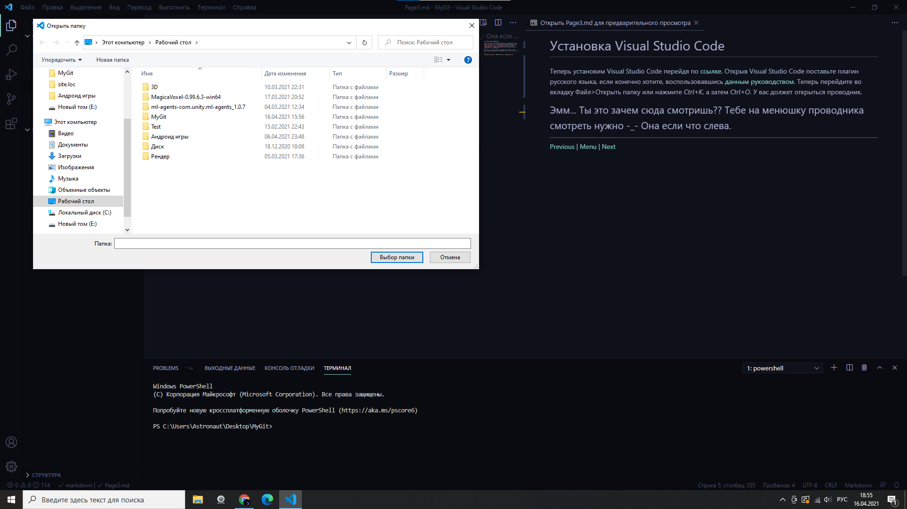

# Установка Visual Studio Code

Теперь установим Visual Studio Code перейдя по [ссылке](https://code.visualstudio.com/). Открыв Visual Studio Code поставьте плагин русского языка, если конечно хотите, воспользовавшись [данным руководством](https://mirsovetov.net/vs-code-language.html). Теперь перейдите во вкладку Файл>Открыть папку или нажмите *Ctrl+K*, а затем *Ctrl+O*. У вас должет открыться проводник. Всё должно выглядеть как-то так:

Теперь просто выберете подходящее место для вашего каталога, кликните правой кнопкой мыши по пустому месту и выберите *Создать папку*.Назовите её как вам нужно, тапните *Enter* и нажмите совершенно непримечательную кнопку справа снизу *Выбор папки*. Поздравляю! Вы создали папку в которой будет находиться ваша работа.

---

[Назад](./Page2.md) | [Меню](readme.md) | [Дальше](Page4.md)